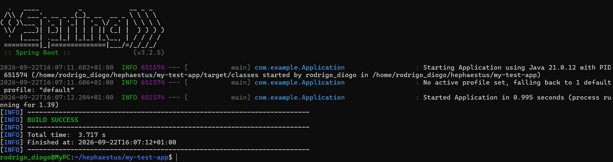
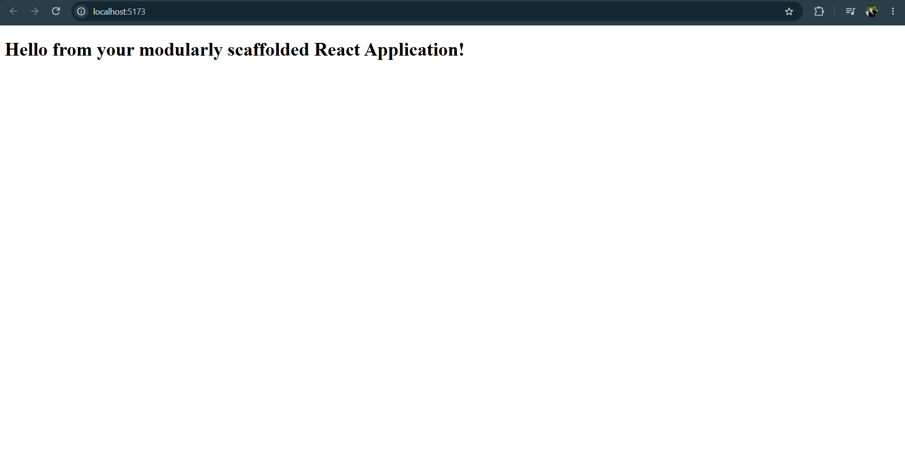
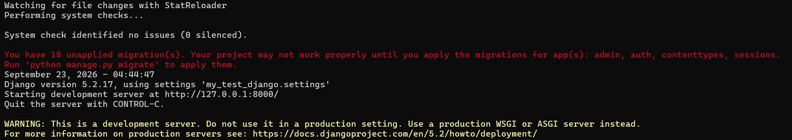

# On Hephaestus and a small journey regarding working with three different LLMs

The goal for this project was to create a small scaffolding tool that would generate a basic skeleton for a Spring Boot,
React, or Django project, based on a configuration file. At the same time, it was also about how different LLMs and AIs
behaved when asked to help with the same task, and how they compared to each other.

## 1. Claude, Gemini, and ChatGPT

It's important to take into account that this was a (very) small project, and it's not a definitive, scientific comparison
based on deep research. It's more a retelling of personal experiences and general impressions, and not an exhaustive analysis.

In the end, Gemini was very "resilient" when it came to its free usage, but it was also very "polite" and tried to 
please me, even when it was making serious mistakes. It required quite a bit of handholding as it didn't really take
architecture and good practices into account, and it was very verbose in its explanations. It also had a tendency to 
hallucinate and make up things that didn't exist. So, after building a lot of the code and the overall project with Gemini,
I took debugging and fixing over with Claude. Claude was much more concise and to the point, and it was able to catch 
many of the mistakes I made with Gemini (namely a lot of the specifics regarding what each stack needed for their scaffolding). 

GPT, somewhat humorously, was able to catch a few things that both Claude and Gemini didn't notice, so using all three
together at different points was a strength in itself; however, in my opinion, Claude was the most useful of them all 
for this particular project as it actively considers good software design, scalability and maintainability, and doesn't
try to glue forcefully together something right away.

Copilot was also used to help with some of the boilerplate code, but it was not as useful as the other three LLMs for 
this particular project, at least regarding code as I didn't use the built-in chat too much (it, was, however, very useful 
for writing the README).

When offered the same document in their initial prompts, three things were very clear: 
- All three can be quite literal and rigid in their interpretation of the task;
- They have extremely different tones (Gemini is very uppity and enthusiastic, Claude is  concise and to the point, and 
GPT is friendly and reassuring);
- Given the task, all three, to differing degrees, try to decide for you on a solution, schedule and intent (on this front,
GPT was the most "policing" of three).

Prompts that maybe worked:


Prompts that might have not worked:


Gemini trying to "please" me:


Limitations regarding Gemini usage:


GPT picking up something Claude did not notice:


## 2. Hephaestus proper
Regarding hephaestus:

```
        ┌─────────────────────────────┐
        │   1. Configuration Layer    │  <-- Settings reads hephaestus.properties,
        │         (Settings)          │      validates project name & stack
        └──────────────┬──────────────┘
                        │
        ┌───────────────▼──────────────┐
        │   2. Orchestration Layer     │  <-- ScaffoldManager creates the root
        │      (ScaffoldManager)       │      folder, writes .gitignore & README,
        └───────────────┬──────────────┘      and runs `git init`
                        │
        ┌───────────────▼──────────────┐
        │      3. Stack Kit Layer      │  <-- One StackKit implementation per
        │      (StackKit interface)    │      supported stack, selected by name
        └───────────────────────────────┘

Adding a new stack means writing one new StackKit implementation, nothing above this layer needs to change.
```

Named after the Greek god of the forge, Hephaestus does the unglamorous work of hammering out a project's skeleton so
you don't have to: point it at a config file, and it forges a ready-to-run Spring Boot, React, or Django project (with
more stacks as a possibility in the future). It assembles your folder structure, starter files, `.gitignore`, and 
`git init`, all in one strike.

It exists to remove the part of starting a new project that never changes, the boilerplate, so the first commit is 
already something worth building on.

## Prerequisites

Before running Hephaestus or any project it generates, make sure you have:

- **Java 17 or later**
- **Maven**
- **Node.js and npm** (needed only if you plan to generate or run a React project)
- **Python 3 and pip** (needed only if you plan to generate or run a Django project)

Hephaestus itself is a Java/Maven project, so Java and Maven are required regardless of which stack you scaffold.
Node/npm and Python/pip are only needed afterward, to run a *generated* React or Django project, not to run Hephaestus 
itself.

## Configuration

Hephaestus reads its settings from a `hephaestus.properties` file in the project's root directory. Create one before 
running the tool with this exact name and the following contents:

```properties
project.name=my-app
project.stack=spring
```

**Keys:**

- **`project.name`** (required) — any string; becomes the name of the folder that gets created for the generated project
- **`project.stack`** (required) — must be `spring`, `django` or `react`, for now; determines which stack gets scaffolded

If either key is missing, or `project.stack` isn't one of the supported values, Hephaestus prints an error and stops 
without generating anything:

```
⚡ Booting Hephaestus...
❌ Error: Stack not supported by Hephaestus.

Process finished with exit code 0
```

If everything (the exact path will differ on your machine) is working properly , however...

```
⚡ Booting Hephaestus...
✅ Success! Loaded settings from file.
Project Name: my-app
Project Stack: SPRING
------------------------------------------------
📁 Initializing modular scaffolding execution at: /home/rodrigo_diogo/hephaestus/my-app
🍃 Injecting modular Spring template blueprint...
🚀 Scaffolding for project 'my-app' completed successfully!

Process finished with exit code 0
```

## Running the generator

1. Create a `hephaestus.properties` file in the project's root, following the format shown in the [Configuration] section
above.

2. Build the jar:

```
mvn package
```

3. Run it:

```
java -jar target/hephaestus-1.0-SNAPSHOT.jar
```

Hephaestus reads the config, generates the scaffolded project in a new folder (named after `project.name`) alongside 
the jar, and initializes it as a git repository.

**Note:** if a folder matching `project.name` already exists, Hephaestus will write into it without warning. Choose 
a fresh name, or make sure it's safe to overwrite.

## Running the generated project

Once Hephaestus has generated your project, cd into the new folder and run it based on which stack you chose.

**Spring:**
```
mvn spring-boot:run
```


You should see the Spring Boot banner and a line confirming the application started.

**React:**
```
npm install
npm run dev
```

Vite will print a local URL (typically `http://localhost:5173`). Open it in a browser to see the app running:


**Django:**
```
python3 -m venv venv
source venv/bin/activate
pip install -r requirements.txt
python manage.py runserver
```

You should see `System check identified no issues` followed by `Starting development server at http://127.0.0.1:8000/`.
