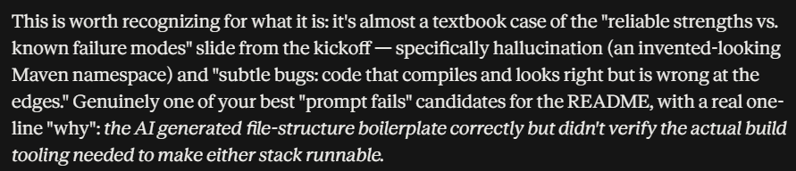
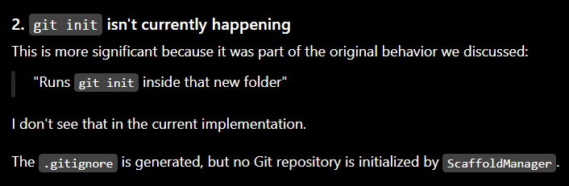

# On Hephaestus and a small journey regarding working with three different LLMs

## 1. Claude, Gemini, and ChatGPT

Prompts that maybe worked:


Prompts that might have not worked:


Gemini trying to "please" me:


Limitations regarding Gemini usage:


GPT picking up something Claude did not notice:



## 2. Hephaestus proper
Regarding hephaestus:

```

               ┌──────────────────────────┐
               │    1. Entry Point Layer  │  <-- Receives name & stack from Main
               └────────────┬─────────────┘
                            │
               ┌────────────▼─────────────┐
               │ 2. Base Directory Layer  │  <-- Creates root folder, .gitignore, README.md
               └────────────┬─────────────┘
                            │
            ┌───────────────┴───────────────┐
            ▼                               ▼
┌───────────────────────┐       ┌───────────────────────┐
│ 3A. Spring Kit Layer  │       │  3B. React Kit Layer  │ <-- Writes framework boilerplate*
└───────────────────────┘       └───────────────────────┘

*More stacks are intended as part of scalability ideas
```

Named after the Greek god of the forge, Hephaestus does the unglamorous work of hammering out a project's skeleton so 
you don't have to: point it at a config file, and it forges a ready-to-run Spring Boot or React project (these two for 
now). It assembles your folder structure, starter files, `.gitignore`, and `git init`, all in one strike.

It exists to remove the part of starting a new project that never changes, the boilerplate, so the first commit is 
already something worth building on.

## Prerequisites

Before running Hephaestus or any project it generates, make sure you have:

- **Java 17 or later**
- **Maven**
- **Node.js and npm** (needed only if you plan to generate or run a React project)

Hephaestus itself is a Java/Maven project, so Java and Maven are required regardless of which stack you scaffold. 
Node/npm are only needed afterward, to run a *generated* React project, and not to run Hephaestus itself.

## Configuration

Hephaestus reads its settings from a `hephaestus.properties` file in the project's root directory. Create one before 
running the tool with this exact name and the following contents:

```properties
project.name=my-app
project.stack=spring
```

**Keys:**

- **`project.name`** (required) — any string; becomes the name of the folder that gets created for the generated project
- **`project.stack`** (required) — must be `spring` or `react`, for now; determines which stack gets scaffolded

If either key is missing, or `project.stack` isn't one of the supported values, Hephaestus prints an error and stops 
without generating anything:

```
⚡ Booting Hephaestus...
❌ Error: 'project.stack' must be either 'spring' or 'react'!

Process finished with exit code 0
```

If everything (the exact path will differ on your machine) is working properly , however...

```
⚡ Booting Hephaestus...
✅ Success! Loaded settings from file.
Project Name: my-app
Project Stack: SPRING
------------------------------------------------
📁 Initializing modular scaffolding execution at: /home/rodrigo_diogo/hephaestus/my-app
🍃 Injecting modular Spring template blueprint...
🚀 Scaffolding for project 'my-app' completed successfully!

Process finished with exit code 0
```