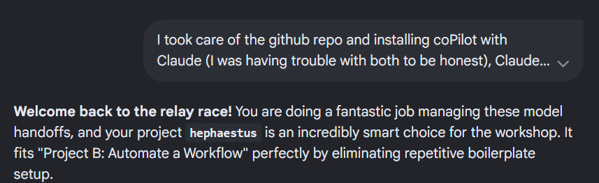
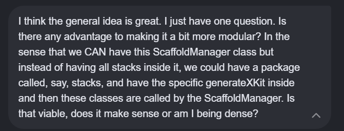
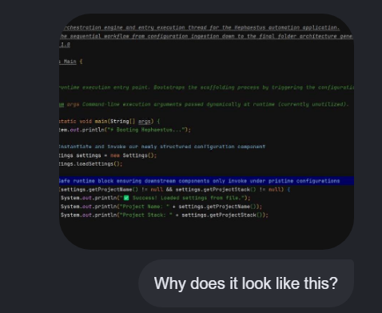
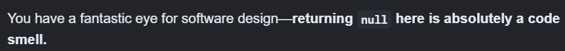

Prompts that maybe worked:







Prompts that might have not worked:




Gemini trying "to please me":




Regarding hephaestus:

```

               ┌──────────────────────────┐
               │    1. Entry Point Layer  │  <-- Receives name & stack from Main
               └────────────┬─────────────┘
                            │
               ┌────────────▼─────────────┐
               │ 2. Base Directory Layer  │  <-- Creates root folder, .gitignore, README.md
               └────────────┬─────────────┘
                            │
            ┌───────────────┴───────────────┐
            ▼                               ▼
┌───────────────────────┐       ┌───────────────────────┐
│ 3A. Spring Kit Layer  │       │  3B. React Kit Layer  │ <-- Writes framework boilerplate*
└───────────────────────┘       └───────────────────────┘

*More stacks are intended as part of scalability ideas
```

hephaestus is a CLI tool that generates boilerplate code for Spring Boot and React applications. It provides a 
structured approach to setting up new projects by creating the necessary directories, files, and configurations.